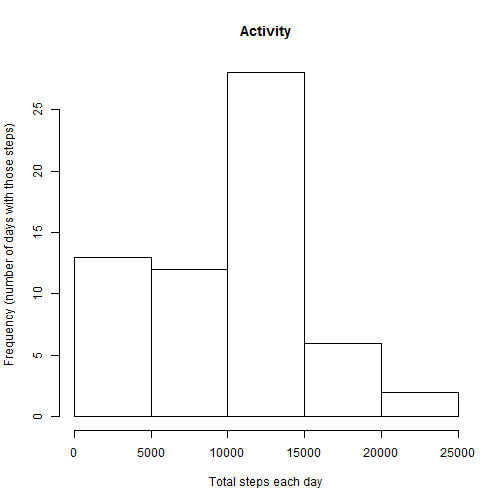
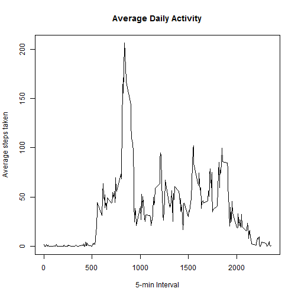
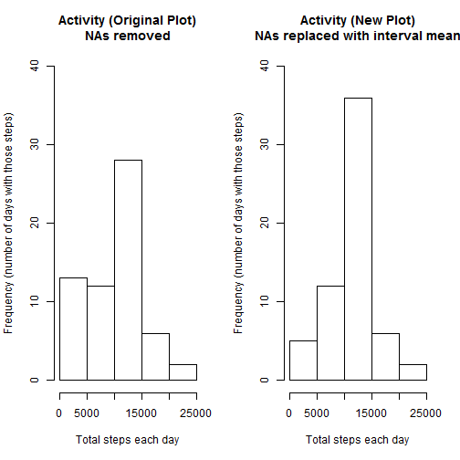
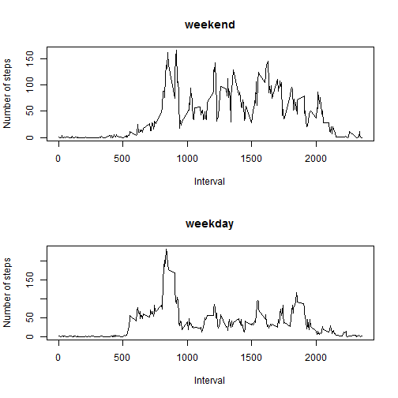

###Loading and preprocessing the data

Set up any initial parameters, load the data into 'activity' and format the date column


```r
library(dplyr)
library(lubridate)
library(chron)
par(mfcol = c(1,1))
activity <- tbl_df(read.csv("activity.csv", na.strings = "NA"))
mutate(activity,date = ymd(date))
```

```
## Source: local data frame [17,568 x 3]
## 
##    steps       date interval
## 1     NA 2012-10-01        0
## 2     NA 2012-10-01        5
## 3     NA 2012-10-01       10
## 4     NA 2012-10-01       15
## 5     NA 2012-10-01       20
## 6     NA 2012-10-01       25
## 7     NA 2012-10-01       30
## 8     NA 2012-10-01       35
## 9     NA 2012-10-01       40
## 10    NA 2012-10-01       45
## ..   ...        ...      ...
```

```r
head(activity)
```

```
## Source: local data frame [6 x 3]
## 
##   steps       date interval
## 1    NA 2012-10-01        0
## 2    NA 2012-10-01        5
## 3    NA 2012-10-01       10
## 4    NA 2012-10-01       15
## 5    NA 2012-10-01       20
## 6    NA 2012-10-01       25
```

###What is mean total number of steps taken per day?

Histogram of the total number of steps per day


```r
activity_sum_steps <- summarize(group_by(activity,date), sum = sum(steps, na.rm = TRUE))
hist(activity_sum_steps$sum, main = "Activity", xlab = "Total steps each day", ylab = "Frequency (number of days with those steps)")
```

 

Calculate the mean and median of the total steps per day


```r
mean(activity_sum_steps$sum)
```

```
## [1] 9354.23
```

```r
median(activity_sum_steps$sum)
```

```
## [1] 10395
```

###What is the average daily activity pattern?

Time-series plot of the 5-min interval and the average steps taken averaged across all days


```r
activity_ave_steps <- summarize(group_by(activity,interval), ave = mean(steps, na.rm = TRUE))
plot(activity_ave_steps$interval, activity_ave_steps$ave, type="l",
     main = "Average Daily Activity", xlab = "5-min Interval", ylab = "Average steps taken")
```

 

5-min interval that has the maximum number of steps, on average


```r
activity_ave_steps[activity_ave_steps$ave==max(activity_ave_steps$ave),]
```

```
## Source: local data frame [1 x 2]
## 
##   interval      ave
## 1      835 206.1698
```

###Inputing missing values

Total number of missing values


```r
colSums(is.na(activity))
```

```
##    steps     date interval 
##     2304        0        0
```

The strategy for filling in the missing values will be to use the mean for that 5-min interval.

Here is the new data set with the missing data filled in using that strategy.


```r
activity_nas_replaced <- mutate(activity, steps = ifelse(is.na(activity$steps),activity_ave_steps$ave,activity$steps))
activity_nas_replaced
```

```
## Source: local data frame [17,568 x 3]
## 
##        steps       date interval
## 1  1.7169811 2012-10-01        0
## 2  0.3396226 2012-10-01        5
## 3  0.1320755 2012-10-01       10
## 4  0.1509434 2012-10-01       15
## 5  0.0754717 2012-10-01       20
## 6  2.0943396 2012-10-01       25
## 7  0.5283019 2012-10-01       30
## 8  0.8679245 2012-10-01       35
## 9  0.0000000 2012-10-01       40
## 10 1.4716981 2012-10-01       45
## ..       ...        ...      ...
```

Histogram of the total number of steps taken each day, along with the mean and median.

For comparison purposes, the two graphs are displayed side by side, which shows that adding the missing NA values did impact the results.
By adding in the new values, the histogram increases the frequency significantly for the first and third bars.


```r
activity_nas_replaced_sum_steps <- summarize(group_by(activity_nas_replaced,date), sum = sum(steps, na.rm = TRUE))

par(mfcol = c(1,2))
hist(activity_sum_steps$sum, main = "Activity (Original Plot)\nNAs removed",
     xlab = "Total steps each day", ylab = "Frequency (number of days with those steps)", ylim = c(0,40))
hist(activity_nas_replaced_sum_steps$sum, main = "Activity (New Plot)\nNAs replaced with interval mean",
     xlab = "Total steps each day", ylab = "Frequency (number of days with those steps)", ylim = c(0,40))
```

 

###Are there differences in activity patterns between weekdays and weekends?

Create new factor with "weekday" and "weekend" levels


```r
activity_nas_replaced_with_weekdays <- mutate(activity_nas_replaced, weekdays = ifelse(is.weekend(date),"weekend","weekday"))
table(activity_nas_replaced_with_weekdays$weekdays)
```

```
## 
## weekday weekend 
##   12960    4608
```

2-panel time series plot for both levels


```r
par(mfcol = c(2,1))
activity_nas_replaced_with_weekdays_ave_steps <- summarize(group_by(activity_nas_replaced_with_weekdays,interval,weekdays),
                                                           ave = mean(steps, na.rm = TRUE))
with(subset(activity_nas_replaced_with_weekdays_ave_steps,weekdays == c("weekend")),
     plot(interval,ave, type ="l",
          main = "weekend", xlab = "Interval", ylab = "Number of steps"))
with(subset(activity_nas_replaced_with_weekdays_ave_steps,weekdays == c("weekday")),
     plot(interval,ave, type ="l",
          main = "weekday", xlab = "Interval", ylab = "Number of steps"))     
```

 

That's all folks!
